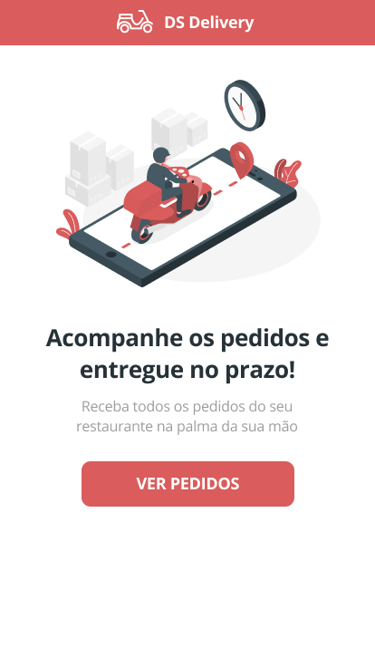
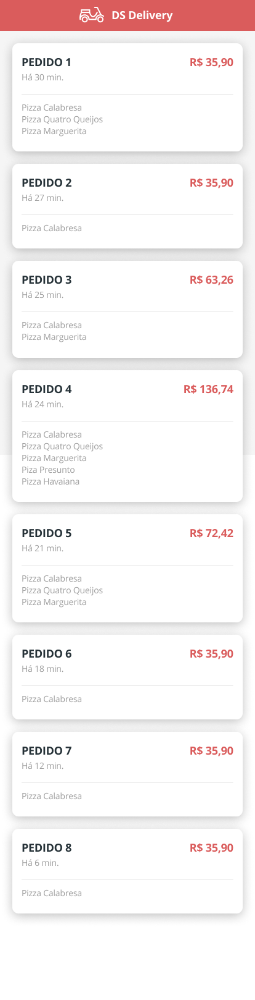
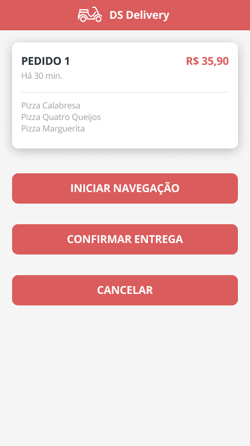
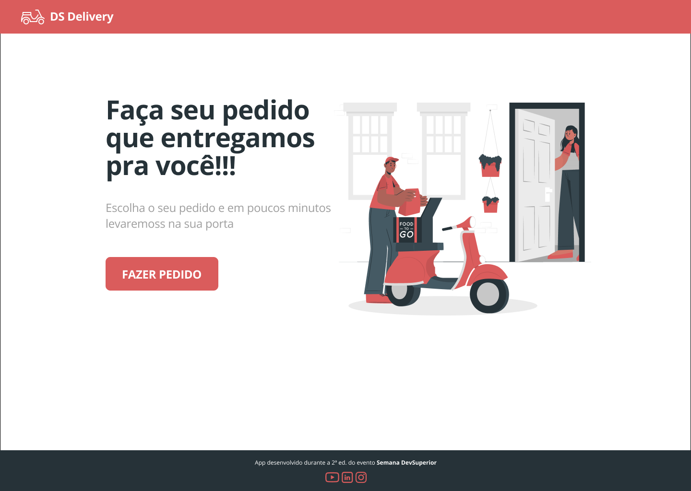
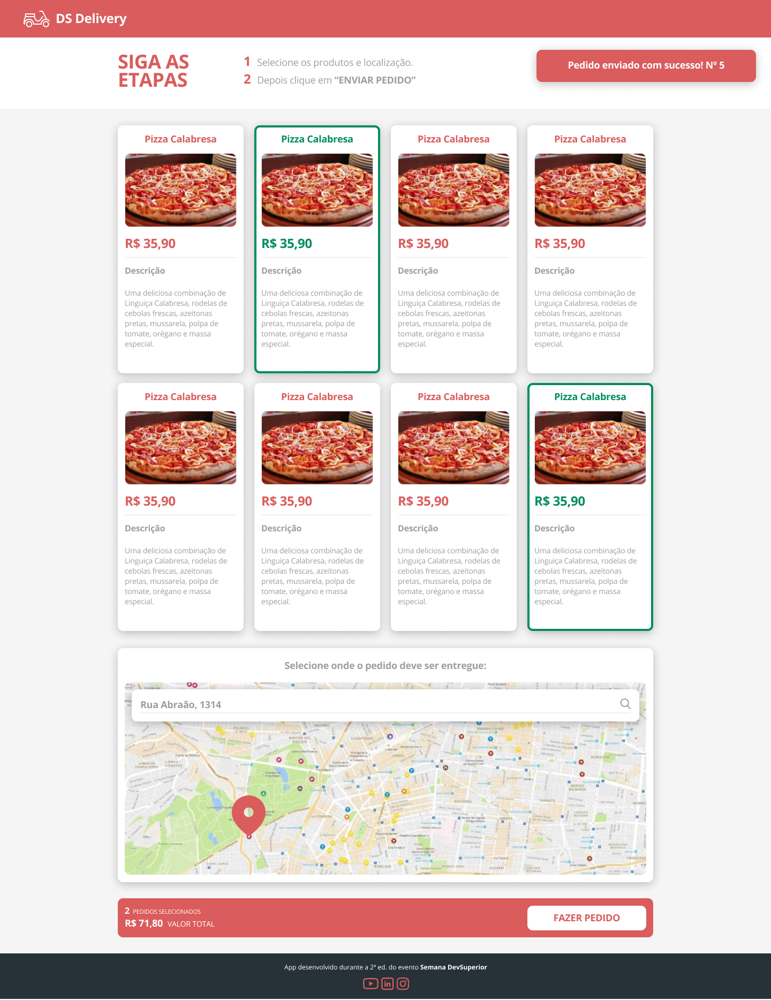

<p align="center">
  <a href="https://dsdelivery-anabalves.netlify.app/">
    
  </a>
</p>

<h1 align="center">DS Delivery</h1>

# 📖 Sobre

[DS Delivery](https://dsdelivery-anabalves.netlify.app/) é uma aplicação construída durante a Semana Spring React organizada pela DevSuperior.

A aplicação consiste em um delivery de comida, os pedidos são realizados na aplicação web e depois via app mobile o entregador poderá acompanhar os pedidos e confirmar a entrega.

Durante o desenvolvimento foi criada uma 
API com quatros métodos:

- GET /orders: retorna todos os pedidos do sistema de banco de dados que ainda estão pendentes;
- GET /products: retorna todos os produtos disponíveis para a compra;
- POST /orders: envia todas as informações do pedido que o cliente fez para o banco de dados;
- PUT /orders/{id}/delivered: atualiza o status do pedido para entregue.

A landing page é composta por uma frase de efeito, uma imagem e um botão que levará o usuário à tela responsável pelo pedido do cliente, que, por sua vez, é uma página que possui as orientações para o cliente, a lista de produtos, um mapa para obter a localização do usuário e o botão para confirmar o pedido.

<p align="center">
  
  
</p>

# 🚀 Tecnologias e Ferramentas

Esse projeto foi desenvolvido com as seguintes tecnologias e ferramentas:

- Java
- Spring Boot
- JPA / Hibernate
- Maven
- HTML / CSS / JavaScript / TypeScript
- ReactJS
- React Native
- Apex Charts
- Expo
- Heroku
- Netlify
- PostgreSQL
- Postman
- Visual Studio Code
- IntelliJ IDEA
- Git

# 🎲 Modelo Conceitual

<p align="center">
  
</p>

# Layouts

## 📱 Layout Mobile

<p align="center">
  
</p>
<p align="center">
  
</p>
<p align="center">
  
</p>

## 💻 Layout Web

<p align="center">
  
  
</p>

# Backend

<p align="center">
  
</p>

[Swagger](https://dsdelivery-anabalves.herokuapp.com/swagger-ui/)

# Como executar o projeto

## Backend
Pré-requisitos: Java 11

```bash
# clonar repositório
git clone https://github.com/anabalves/full-stack-projects

# entrar na pasta do projeto dsdelivery
cd dsdelivery

# entrar na pasta do projeto backend
cd backend

# executar o projeto
./mvnw spring-boot:run
```

## Front web
Pré-requisitos: npm / yarn

```bash
# clonar repositório
git clone https://github.com/anabalves/full-stack-projects

# entrar na pasta do projeto dsdelivery
cd dsdelivery

# entrar na pasta do projeto front web
cd front-web

# instalar dependências
yarn install

# executar o projeto
npm start
```

## Front mobile
Pré-requisitos: npm / yarn

```bash
# clonar repositório
git clone https://github.com/anabalves/full-stack-projects

# entrar na pasta do projeto dsdelivery
cd dsdelivery

# entrar na pasta do projeto front mobile
cd front-mobile

# instalar dependências
yarn install

# executar o projeto
npm start

# abrir a url disponibilizada no console no celular
```


Feito por Ana Beatriz com ensinamentos da escola DevSuperior!