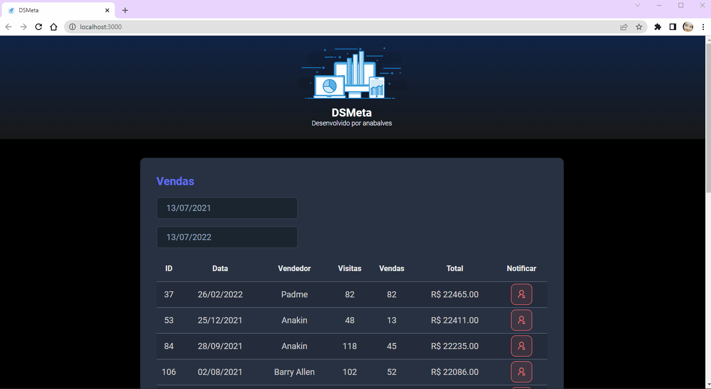
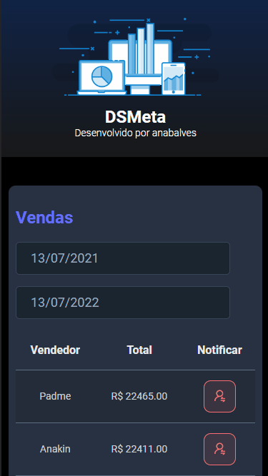
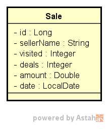
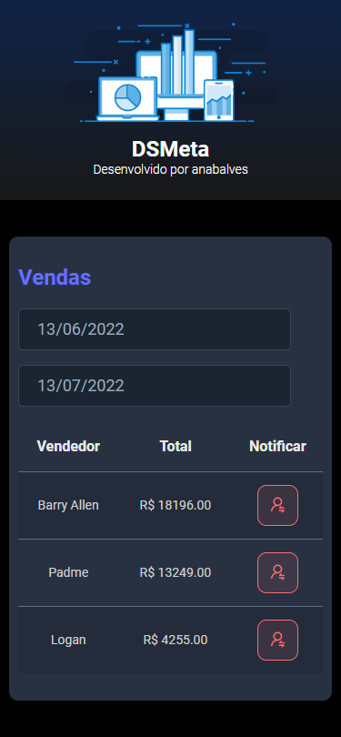
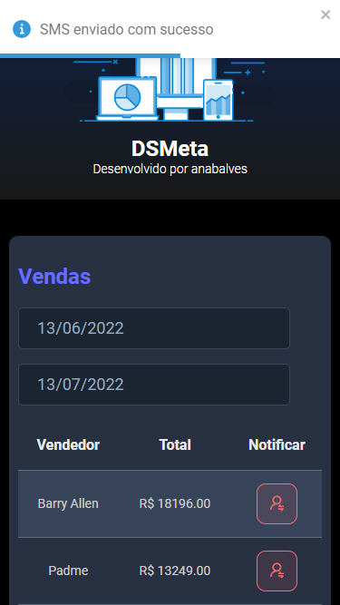
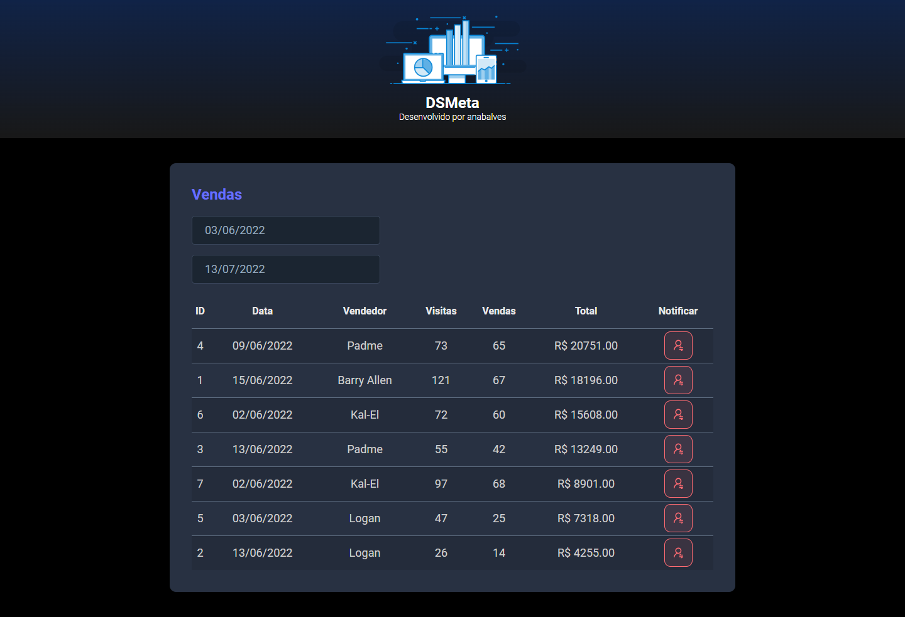
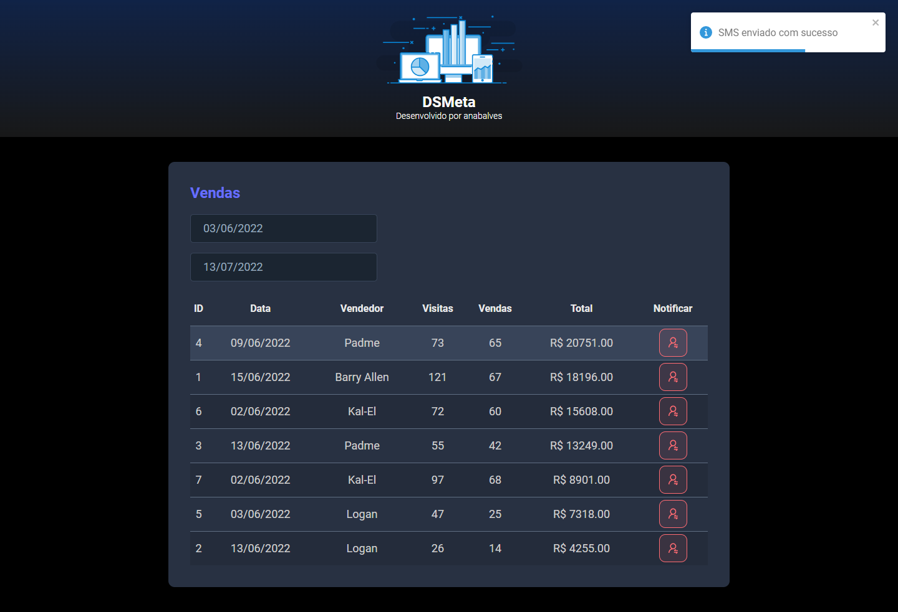
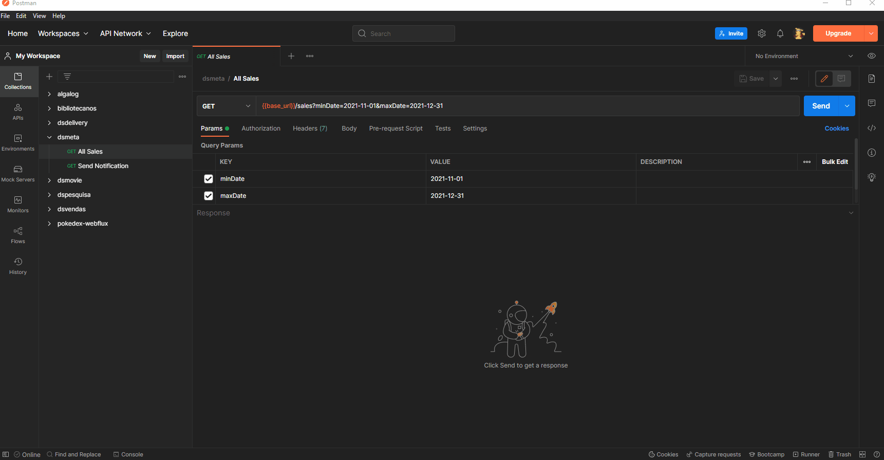

<p align="center">
  <a href="https://dsmeta-anabalves.netlify.app/">
    
  </a>
</p>

<h1 align="center">DSMeta</h1>

# 📖 Sobre

[DSMeta](https://dsmeta-anabalves.netlify.app/) é uma aplicação construída durante a Semana Spring React organizada pela DevSuperior.

A aplicação consiste em uma consulta de vendas, no qual podemos buscar vendas em um dado intervalo de datas, e Enviar Notificação via SMS com os Dados dos Melhores Vendedores.

Durante o desenvolvimento foi criada uma API com 2 métodos:

- GET ​/sales: retorna todos as vendas;
- GET ​/sales/{id}/notification: envia uma notificação via SMS com os Dados dos Melhores Vendedores;

<p align="center">
  
  
</p>

# 🚀 Tecnologias e Ferramentas

Esse projeto foi desenvolvido com as seguintes tecnologias e ferramentas:

- Java
- Spring Boot
- JPA / Hibernate
- Maven
- Swagger
- HTML / CSS / JavaScript / TypeScript
- ReactJS
- Vite
- Heroku
- Netlify
- H2
- PostgreSQL
- Postman
- Visual Studio Code
- IntelliJ IDEA
- Git

# 🎲 Modelo Conceitual

<p align="center">
  
</p>

# Layouts

## 📱 Layout Mobile

<p align="center">
  
  <br>
  
</p>

## 💻 Layout Web

<p align="center">
  
  
</p>

# Backend

<p align="center">
  
</p>

[Swagger](https://dsmeta-anabalves.herokuapp.com/swagger-ui/)

# Como executar o projeto

## Backend

Pré-requisitos: Java 11

```bash
# clonar repositório
git clone https://github.com/anabalves/full-stack-projects

# entrar na pasta do projeto dsmeta
cd dsmeta

# entrar na pasta do projeto backend
cd backend

# executar o projeto
./mvnw spring-boot:run
```

## Frontend

Pré-requisitos: npm / yarn

```bash
# clonar repositório
git clone https://github.com/anabalves/full-stack-projects

# entrar na pasta do projeto dsmeta
cd dsmeta

# entrar na pasta do projeto frontend
cd frontend

# instalar dependências
yarn install

# executar o projeto
yarn dev
```

Feito por Ana Beatriz com ensinamentos da escola DevSuperior!
